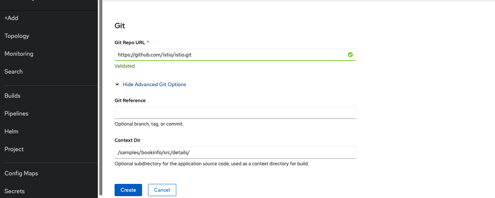

# Dockerfile Build & Deployment via Web Console

Häufig müssen wir die Applikationen erst noch bauen. Will man z. B. eine eigene Applikation entwickeln und diese in OpenShift deployen muss hierfür zunächst das Docker Image gebaut werden. Ein üblicher Mechansimus ist hierfür ein Dockerfile zu schreiben und den Image Build auszuführen.

OpenShift kann diese Image Builds selbst durchführen. Hierfür wird ein neues Konzept namens _BuildConfig_ eingeführt die mehrere _Builds_ erzeugen kann. Es gibt unterschiedliche Build Strategien die durch die _BuildConfig_ durchgeführt werden können. Hier wählen wir die Dockerfile Strategy. Dazu müssen wir wieder auf +Add klicken und Import from Dockerfile auswählen:

Hier sollten folgende Felder angepasst werden, damit OpenShift unser Dockerfile finden kann und die dazugehörigen Ressourcen erstellen kann.

* GIT Repo URL
  * [https://github.com/istio/istio.git](https://github.com/istio/istio.git)
* Context Dir
  * /samples/bookinfo/src/details/
* Container Port
  * 9080
* Application Name
  * bookinfo
* Name
  * details
* Create Route
  * No Route

OpenShift legt daraufhin ein _Deployment_, einen _Service_, und eine _BuildConfig_ an. Die _BuildConfig_ erzeugt einen neuen _Build_, der aus den Anweisungen aus dem Dockerfile das neue Image baut und in die lokale OpenShift Registry pusht. Das neue Image ist unter Administrator/Builds/ImageStreams zu finden. Dieses Image wird durch das Deployment gepulled und ein neuer Pod gestartet.

