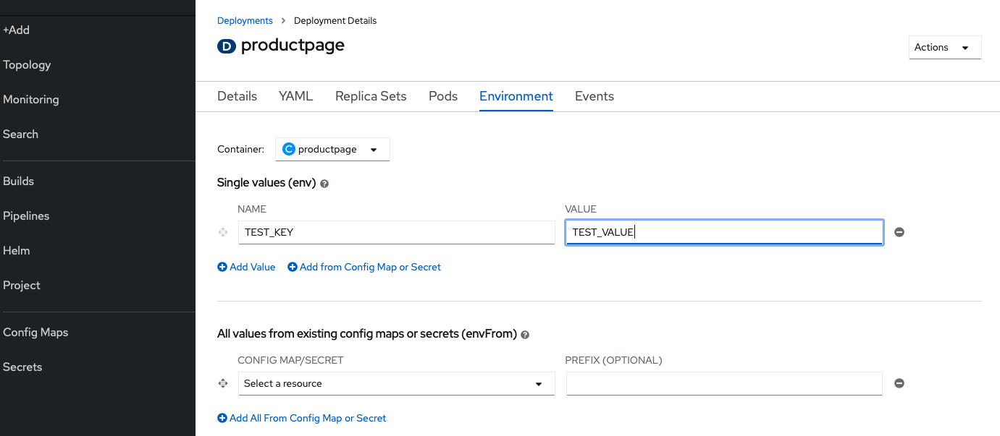
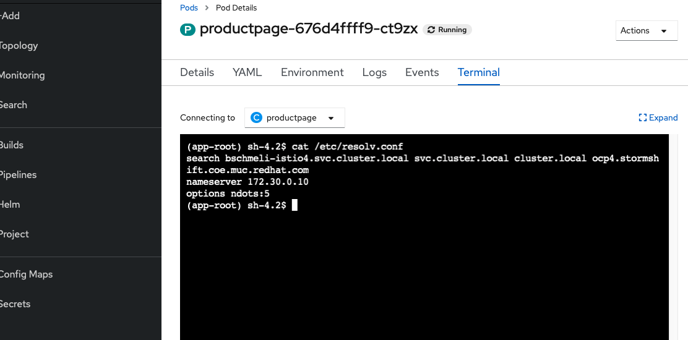

# Logging

In OpenShift werden die Ausgaben der Container auf stdout und stderr automatisch eingesammelt und zentral abgelegt. Diese Logs können dann über OC oder die Web Console ausgewertet werden. Dazu muss immer ein konkreter Pod \(und ggf.. ein Container, wenn sich mehrere in einem Pod befinden\) ausgewählt werden. Für die productpage könt ihr euch zunächst die Pods listen lassen und dann den namen des Pods kopieren \(hier: productpage-676d4ffff9-ct9zx\).

```text
oc get pods|grep productpage

productpage-1-build            0/1     Completed   0          29m
productpage-676d4ffff9-ct9zx   1/1     Running     0          25m

oc logs productpage-676d4ffff9-ct9zx -f

INFO:werkzeug:0.0.0.0 - - [14/Sep/2020 14:37:28] "GET / HTTP/1.1" 200 -
```

Immer wenn ihr die productpage aufruft wird ein neuer Eintrag geloggt.

Alternativ könnt ihr in der Web Console über das Deployment auf den Pod navigieren. Dort gibt es dann die Möglichkeit über den reiter Logs sich die Logs direkt in der Web Console anzeigen zu lassen.


Die Logs können natürlich auch für Jobs, Builds etc. abgerufen werden.

Ein weitere Möglichkeit auf Logs zuzugreifen oder zu debuggen ist das Terminal um eine Console auf einem Pod zu öffnen. Um diese Möglichkeit zu demonstrieren navigieren wir auf eines der **Deployments z.B.** productpage und klicken in der Topology auf dessen Namen und wählen den Reiter Enviroment. Hier tragen wir den Schlüssel TEST\_KEY mit dem Wert TEST\_VALUE ein und speichern ab. Daraufhin wird der Pod neu ausgerollt. 




Wir wechseln auf den Reiter Pods und klicken auf den entsprechenden Pod "productpage-&lt;alphanumstrin&gt; in der Tabelle. Hier wechseln wir dann auf den Reiter Terminal.



Im Terminal vollziehen wir folgende Dinge nach:

* Ob die Environment Variable auslesbar ist:

```text
env|grep TEST_KEY
TEST_KEY=TEST_VALUE
```

* Wie die Namensauflösung des Containers konfiguriert wurde:

```text
cat /etc/resolv.conf 
search istio.svc.cluster.local svc.cluster.local cluster.local ocp4.stormshift.com
nameserver 172.30.0.10
options ndots:5
```

* Ob wir den Details Service aufrufen können

```text
curl details:9080/details/0
{"id":0,"author":"William Shakespeare","year":1595,"type":"paperback","pages":200,"publisher":"PublisherA","language":"English","ISBN-10":"1234567890","ISBN-13":"123-1234567890"}(app-root)
```

