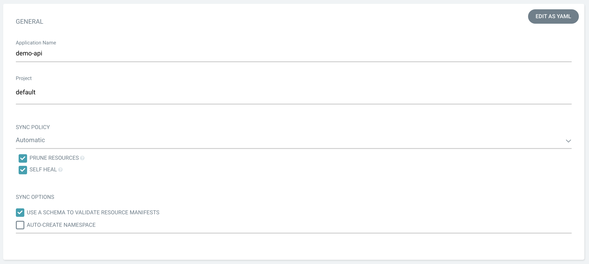
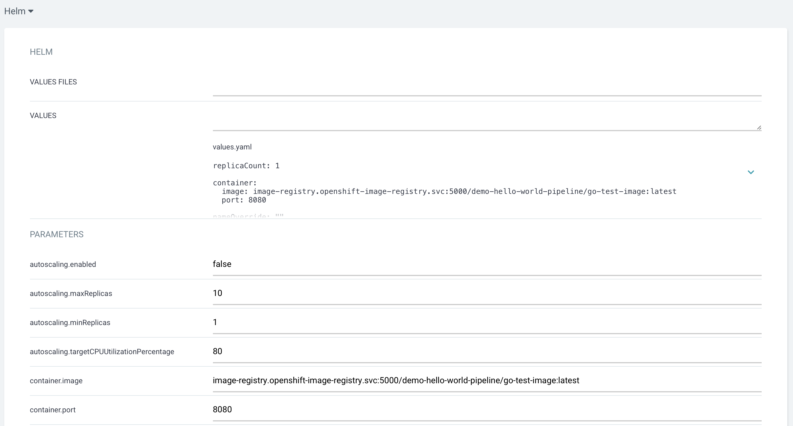

# API Deployment

Wir erstellen eine neue Applikation indem wir auf "New App" klicken.

Wir geben unserer Applikation einen Namen "&lt;eure Initialien&gt;-api" und wählen als Project "default" aus. Für die "Sync Policy" wählen wir "Automatic" und machen ein Häckchen bei "Prune Resources" und "Self Heal". Damit synchronisiert ArgoCD den Stand im git konstant mit dem Stand im Cluster. \(Das testen wir später auch noch\).

In der "Repository URL" tragen wir [https://github.com/wumaxd/golang-presentation](https://github.com/wumaxd/golang-presentation) ein und setzen den "Path" auf den Helm Chart "./exercises/helloWorldAPI/charts/go-api/". ArgoCD überprüft sofort das Repository und stellt die folgenden Settings für einen Helm Chart ein.

Für das Ziel der Applikation wählen wir die "Cluster URL" https://kubernetes.default.svc aus. Das funktioniert, da die ArgoCD Instanz im selben Cluster läuft. Im Feld "Namespace" tragt ihr euren Namespace ein.

Da ArgoCD erkannt hat, das wir das Deployment mittels eines Helm Charts machen wollen, sind die Werte aus der `values.yml` bereits voreingetragen. Ihr müsste jetzt noch den Wert `container.image` auf `image-registry.openshift-image-registry.svc:5000/<euer Namespace>/go-test-image:latest` anpassen.


Wer bereits mit Helm tiefer gearbeitet hat wird hier erkennen, das ArgoCD eine schöne Möglichkeit bietet die [Parameter](https://helm.sh/docs/topics/charts/#templates-and-values) eines [Charts](https://helm.sh/docs/topics/charts/) anzupassen.


Dann klicken links oben wir auf "Create".

